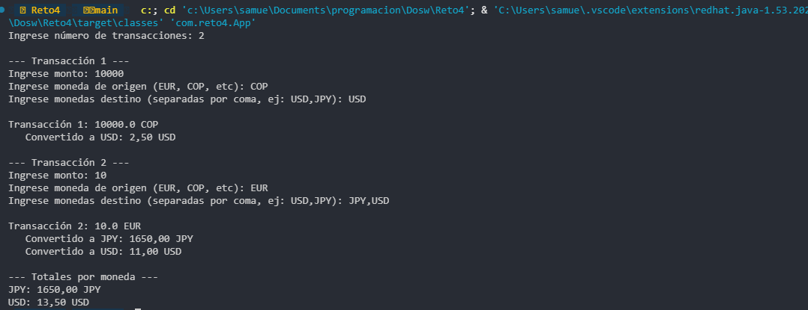

## Samuel Felipe Castelblanco Tellez
## Tomas Olaya Diaz

### 1. Categoría del Patrón
**Patrones de Comportamiento**

### 2. Patrón Utilizado
**Strategy**

### 3. Justificación
Se eligió este patrón para eliminar la lógica rígida de una tasa única y permitir que el sistema soporte múltiples algoritmos de conversión (tasas reales) que pueden cambiar o aumentar en el futuro. Esto permite que el código cumpla con el principio de **Responsabilidad Única** y sea **Fácilmente Extensible** ya que añadir una nueva moneda no requiere modificar la lógica principal de la aplicación.

### 4. Cómo lo aplico
* **Interfaz `Conversor`:** Define el contrato común para todas las lógicas de cambio.
* **Clases Concretas:** Cada moneda (EUR, COP, JPY) implementa su propia fórmula de conversión basada en la tasa real.
* **Contexto Dinámico:** Se utiliza un `Map<String, Conversor>` que actúa como repositorio de estrategias, permitiendo seleccionar la conversión correcta en tiempo de ejecución según la entrada del usuario.
* **Procesamiento con Streams:** Se utiliza `Collectors.groupingBy` y `summingDouble` para agrupar los resultados de diversas transacciones y calcular los totales por moneda de forma eficiente.

### Ejemplo de ejecucion del programa
